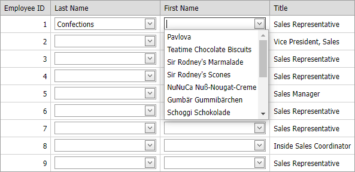

<!-- default badges list -->

[](https://supportcenter.devexpress.com/ticket/details/E4395)
[](https://docs.devexpress.com/GeneralInformation/403183)
<!-- default badges end -->
<!-- default file list -->
*Files to look at*:

* [Default.aspx](./CS/WebSite/Default.aspx) (VB: [Default.aspx](./VB/WebSite/Default.aspx))
* [Default.aspx.cs](./CS/WebSite/Default.aspx.cs) (VB: [Default.aspx.vb](./VB/WebSite/Default.aspx.vb))
<!-- default file list end -->
# Grid View for ASP.NET Web Forms - How to implement cascading combo boxes in grid
<!-- run online -->
**[[Run Online]](https://codecentral.devexpress.com/e4395/)**
<!-- run online end -->

This example demonstrates how to create cascading combo boxes for each row of the [ASPxGridView](https://docs.devexpress.com/AspNet/DevExpress.Web.ASPxGridView) control.



To implement the cascading behavior between a pair of [ASPxComboBox](https://docs.devexpress.com/AspNet/DevExpress.Web.ASPxComboBox) controls defined within the same row, editor settings are specified dynamically in the `Init` event.

```csharp
protected void cmbMaster_Init(object sender, EventArgs e) {
    ASPxComboBox cmbParent = (ASPxComboBox)sender;
    GridViewDataItemTemplateContainer templateContainer = (GridViewDataItemTemplateContainer)cmbParent.NamingContainer;
    cmbParent.ClientSideEvents.SelectedIndexChanged = string.Format("function(s, e) {{ OnSelectedIndexChanged(s, e, {0}); }}", templateContainer.VisibleIndex);
}
protected void cmbChild_Init(object sender, EventArgs e) {
    ASPxComboBox cmbChild = (ASPxComboBox)sender;
    GridViewDataItemTemplateContainer templateContainer = (GridViewDataItemTemplateContainer)cmbChild.NamingContainer;
    cmbChild.ClientInstanceName = string.Format("cmbChild_{0}", templateContainer.VisibleIndex);
    cmbChild.Callback += new DevExpress.Web.CallbackEventHandlerBase(cmbChild_Callback);
}
```

## Documentation

* [Access Controls in Templates on the Server](https://docs.devexpress.com/AspNet/403575/common-concepts/access-controls-in-templates-on-the-server)

## Online Demos

* [Grid - Cascading Editors](https://demos.devexpress.com/ASPxGridViewDemos/GridEditing/CascadingComboBoxes.aspx)
* [Grid - Cascading Editors (Batch Editing)](https://demos.devexpress.com/ASPxGridViewDemos/GridEditing/CascadingComboBoxesBatch.aspx)

## More Examples

* [Combo Box for ASP.NET Web Forms - How to implement cascading combo boxes](https://github.com/DevExpress-Examples/asp-net-web-forms-cascading-comboboxes)
* [How to refer to a client-side control encapsulated in a specific instance of UserControl](https://github.com/DevExpress-Examples/how-to-refer-to-a-client-side-control-encapsulated-in-certain-instance-of-usercontrol-e2102)
